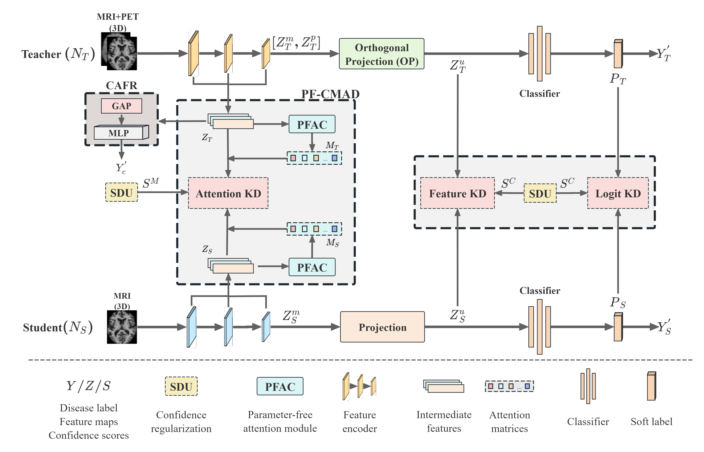

# CRAD: Cognitive Aware Feature Refinement with Missing Modalities for Early Alzheimer’s Progression Prediction

- This is an official code repository for our paper, which can be found in [here](https://www.sciencedirect.com/science/article/pii/S0895611125001739 "here")👈.
- Hope you like this work and do better works 😁.
- The complete code will be publicly available soon! ⌛


## Overall framework of the CRAD

The teacher model (N_T) learns from paired MRI and PET, whereas the student model (N_S) only learns from MRI. First, for N_T, the cognitive awareness feature refinement (CAFR) improves the disease-aware ability of the intermediate features by predicting cognitive scores, and the orthogonal projection (OP) disentangles the modality-specific representation to reduce redundancy. Then, the cross-modal self-attention distillation module (PF-CMAD) aligns intermediate features between N_T and N_S, achieving efficient shallow knowledge distillation. Moreover, the smooth distillation unit (SDU) employs the consistency-aware regularization strategy to refine the distillation on intermediate- and high-level features.

## Highlights
1. A novel hierarchical distillation framework that utilizes multilevel attention alignment to enable effective cross-modal knowledge transfer.
2. A lightweight parameter-free attention distillation module for efficient, robust attentive feature alignment.
3. Consistency-aware confidence regularization for reliable knowledge transfer by evaluating the prediction consistency.


## Project structure:

```
CRAD:
	configs.py
	dataset.py
	models:
		mymodel.py
		...
	main.py
	train_test.py
	utils.py
```
- configs: general configs, can be changed via command params
- dataset: a simple dataset implementation for dataloader
- models: our proposed model and some backbones
- main: call train and test
- train_test: codes for training and testing
- utils: some tools

## How to run the code

- ### Prepare environment. [TODO]
1. Create a conda environment <br>
conda create -n CRAD
2. install Pytorch cuda <br>
conda install pytorch torchvision torchaudio pytorch-cuda=124 -c pytorch -c nvidia
3. install required lib<br>
pip install -r requirements.txt

- ### Train:
1. train teacher
   ```
	python ./main.py --run_teacher y --task task1 --run_mode train
   ```
2. train student
   ```
	python ./main.py --run_teacher n --task task1 --run_mode train
   ```

- ### Test:
1. test teacher
   ```
	python ./main.py --run_teacher y --task task1 --student_name [pretrained model name] --run_mode test
   ```
2. test student
   	```
    python ./main.py --run_teacher n --task task1 --student_name [pretrained model name] --run_mode test
    ```


## Citation

If you think this repository is useful, please cite this paper 😘:
```BibTeX
@article{liu2025crad,
	  title={CRAD: Cognitive Aware Feature Refinement with Missing Modalities for Early Alzheimer’s Progression Prediction},
	  author={Liu, Fei and Liang, Shiuan-Ni and Jaward, Mohamed Hisham and Ong, Huey Fang and Wang, Huabin and Alzheimer’s Disease Neuroimaging Initiative and others},
	  journal={Computerized Medical Imaging and Graphics},
	  pages={102664},
	  year={2025},
	  volumn={126},
	  publisher={Elsevier},
	  doi={doi.org/10.1016/j.compmedimag.2025.102664}
	}
```

## Issue

If you have any questions or problems when using the code in this project, please feel free to send an email to [liu.jason0728@gmail.com](mailto:liu.jason0728@gmail.com "liu.jason0728@gmail.com"). You can also post an issue here.
